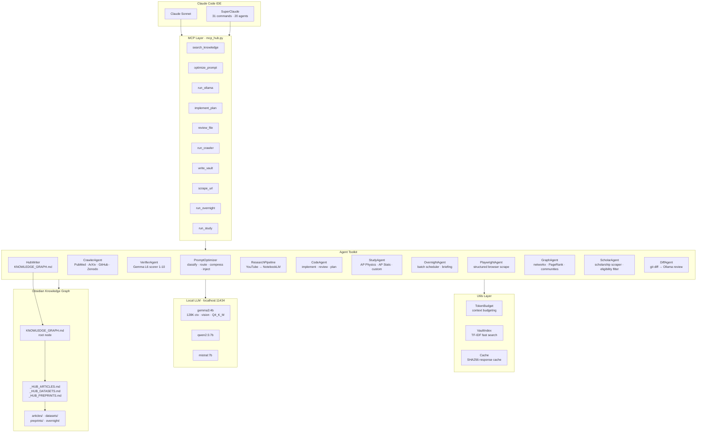

<div align="center">

# HolyClaude

**Production-grade agentic AI stack. Every agent is a real Python script. Everything runs locally on Ollama.**

[](https://python.org)
[](https://ollama.com)
[](https://github.com/anthropics/mcp)
[](LICENSE)
[](https://claude.ai/code)

*Built by [advaycode](https://github.com/advaycode) — high school researcher and builder*

</div>

---

## What This Is

HolyClaude is the distilled meta-framework behind every AI project I've built. It started as scattered scripts across GNN-PCNA, my research pipeline, and a bunch of Obsidian automation — then I generalized everything into a unified agent system.

**Core capabilities:**
- **13-source parallel web crawler** with 5-layer + Gemma L6 LLM-as-judge validation
- **Plug-and-play Ollama agents** — any model, streaming, multi-turn, timed
- **PromptOptimizer** — classify → route → compress → inject vault context → decompose subtasks
- **Full Obsidian knowledge graph** — hub notes, KNOWLEDGE_GRAPH.md root node, Dataview-compatible YAML
- **YouTube → NotebookLM pipeline** — yt-dlp (no API key), unofficial NLM API, vault sync
- **Unified MCP server** — 15 tools exposing every agent to Claude Code
- **Playwright browser agent** — JS-heavy scraping, schema extraction, scholarship detection
- **Overnight scheduler** — batch tasks while you sleep, Ollama morning briefing

---

## System Architecture



---

## Agent Catalog

### Core Base

| Agent | File | Role |
|---|---|---|
| `OllamaAgent` | `agents/base_agent.py` | Base class — streaming, health check, multi-turn, timed chat |
| `PromptOptimizer` | `agents/prompt_optimizer.py` | Classify → route → compress → inject vault → decompose |

### Data Collection

| Agent | File | Role |
|---|---|---|
| `CrawlerAgent` | `agents/crawler_agent.py` | Multi-source parallel crawler, L1–L5 validation, SHA256 dedup |
| `VerifierAgent` | `agents/verifier_agent.py` | Gemma L6 LLM-as-judge, 1–10 credibility scoring, batch mode |
| `PlaywrightAgent` | `agents/playwright_agent.py` | Browser automation, schema scraping, pagination, screenshots |
| `ScholarAgent` | `agents/scholar_agent.py` | Scholarship scraper, eligibility filter, deadline tracker |

### Knowledge Management

| Agent | File | Role |
|---|---|---|
| `KnowledgeWriter` | `agents/knowledge_writer.py` | Obsidian notes from catalog records |
| `HubWriter` | `agents/hub_writer.py` | Full knowledge graph — hubs + KNOWLEDGE_GRAPH.md root |
| `GraphAgent` | `agents/graph_agent.py` | networkx graph — PageRank, community detection, shortest path |

### Code & Development

| Agent | File | Role |
|---|---|---|
| `CodeAgent` | `agents/code_agent.py` | Implement from plan, review, plan — reads CLAUDE.md + REPO_MAP |
| `DiffAgent` | `agents/diff_agent.py` | git diff → per-hunk Ollama review, severity scoring, PR summary |

### Pipelines & Scheduling

| Agent | File | Role |
|---|---|---|
| `ResearchPipeline` | `agents/research_pipeline.py` | YouTube → NotebookLM → vault, no API key |
| `StudyAgent` | `agents/study_agent.py` | Daily topic rotation — AP Physics/Stats or custom, state.json |
| `OvernightAgent` | `agents/overnight_agent.py` | Batch scheduler — research/study/crawl/script, morning briefing |

### Utilities

| Module | File | Role |
|---|---|---|
| `TokenBudget` | `utils/token_budget.py` | Context budgeting, priority-weighted assembly, sliding window |
| `VaultIndex` | `utils/vault_index.py` | TF-IDF indexer, cosine similarity, mtime-aware incremental update |
| `Cache` | `utils/cache.py` | SHA256-keyed LLM response cache, TTL, stats |
| `ModelRegistry` | `configs/models.py` | Model capability table, auto-select, context limits |

---

## Validation Pipeline (L1–L6)

```
Raw URL
  │
  ├─ L1 Network ──── HTTP 200, content-type, timeout=8s, retry×3
  │
  ├─ L2 Format ───── JSON/XML/HTML parse, required fields present
  │
  ├─ L3 Content ──── Non-empty title + abstract, min length
  │
  ├─ L4 Relevance ── Keyword overlap score ≥ min_relevance (default 0.10)
  │
  ├─ L5 Provenance ─ SHA256 dedup, domain allowlist, rate limit (1 req/2s/domain)
  │
  └─ L6 Gemma ────── LLM-as-judge 1–10 score, configurable pass threshold
                      auto_approve_types bypass scoring (e.g. pdb_structure)
```

---

## MCP Tools Reference

Register `agents/mcp_hub.py` in Claude Code → 15 tools available:

| Tool | Signature | What It Does |
|---|---|---|
| `search_knowledge` | `(query, vault_path?)` | TF-IDF vault search, returns file + preview |
| `optimize_prompt` | `(prompt, domain?, llm_classify?)` | Full routing plan: model, system, vault snippets |
| `run_ollama` | `(prompt, task_type?, model?)` | Direct agent call — implement/review/plan/debug/ask |
| `run_research` | `(topic, n_videos?, artifact_types?)` | YouTube → NotebookLM → vault |
| `run_crawler` | `(topic, keywords?, workers?)` | Multi-source crawl, returns catalog path + stats |
| `verify_catalog` | `(catalog_path, domain?, min_score?)` | Gemma L6 batch scoring |
| `write_vault` | `(catalog_path, vault_path?, project_name?)` | Full hub notes + KNOWLEDGE_GRAPH |
| `implement_plan` | `(plan_path, project_root?)` | CodeAgent implement from .md plan |
| `review_file` | `(file_path, project_root?)` | CodeAgent file review |
| `generate_plan` | `(task, project_root?)` | CodeAgent implementation plan |
| `scrape_url` | `(url, schema?, multi?)` | Playwright structured scrape |
| `run_study` | `(subject?, artifact?, force_topic?)` | StudyAgent daily pipeline |
| `run_overnight` | `(tasks_json, parallel?)` | OvernightAgent batch run |
| `list_agents` | `()` | All agents + Ollama status |
| `pipeline_status` | `()` | Package + tool health check |

**Registration** (`~/.claude/claude_desktop_config.json`):
```json
{
  "mcpServers": {
    "holy-claude": {
      "command": "python",
      "args": ["C:/Users/advay/HolyClaude/agents/mcp_hub.py"]
    }
  }
}
```

---

## Multi-Agent Role Separation

| Agent | Handles | Does NOT touch |
|---|---|---|
| **Claude Code** (Sonnet) | Architecture, planning, research synthesis, PR reviews | Implementation, code generation |
| **Gemma 3:4b** (local) | Implementation from plans, code review, data scoring | Architecture decisions |
| **VerifierAgent** | Credibility scoring 1–10 per record | Coding, repo navigation |
| **NotebookLM** | Research extraction from papers/videos | Coding, inference |
| **CrawlerAgent** | Multi-source data collection, dedup | Analysis, generation |
| **HubWriter** | Vault persistence, wikilinks | Analysis, model calls |

---

## Quick Start

```bash
git clone https://github.com/advaycode/HolyClaude
cd HolyClaude
pip install -r requirements.txt

# Start local LLM
ollama serve &
ollama pull gemma3:4b

# Check everything is running
python cli.py status
```

### Research pipeline (crawl → verify → vault)
```bash
python cli.py crawl "PCNA cryptic pocket GNN" \
  --keywords "cryptic pocket" "GNN" "AlphaFold" \
  --verify \
  --vault C:/Users/advay/Obsidian/Research
```

### YouTube → NotebookLM pipeline
```bash
python cli.py research "graph neural network protein structure" \
  --n 6 \
  --artifacts report flashcards mindmap \
  --vault C:/Users/advay/Obsidian/Research
```

### Code agent (implement from plan)
```bash
python cli.py implement docs/plans/parse_pdb.md \
  --project C:/Users/advay/GNN_PNCA
```

### Daily study rotation
```bash
python cli.py study --subject ap-physics --artifact video
python cli.py study --subject ap-stats --artifact flashcards
```

### Overnight batch
```bash
python cli.py overnight \
  --research "AlphaFold cryptic pockets" "GATv2 protein graphs" \
  --study ap-physics \
  --vault C:/Users/advay/Obsidian
```

### Scholarship scraper
```bash
python agents/scholar_agent.py \
  --min-amount 500 \
  --deadline-within 90 \
  --output data/scholarships \
  --vault C:/Users/advay/Obsidian/Scholarships
```

---

## Workflows

| Workflow | File | Pipeline |
|---|---|---|
| Data pipeline | `workflows/data_pipeline.py` | crawl → verify → vault |
| Research flow | `workflows/research_flow.py` | YouTube → NotebookLM → vault |
| GNN pipeline | `workflows/gnn_pipeline.py` | crawl → PDB fetch → graphs → train |
| Scholar flow | `workflows/scholar_flow.py` | scrape → filter → rank → vault |

---

## Projects This Powers

| Project | Stack | Description |
|---|---|---|
| **GNN-PCNA** | PyTorch Geometric, GATv2Conv, Streamlit, 13-source crawler, Gemma L6 | Cryptic pocket prediction on PCNA homotrimer |
| **Stock Trader** | Alpaca API, ML signals, backtesting | Algorithmic trading bot |
| **OpenMontage** | Remotion, FFmpeg, React, 52 tools | Agentic video generation platform |
| **Faceless Pipeline** | AI video factory, thumbnail gen | Automated YouTube content |
| **Research Program Scraper** | Playwright, AI extraction | Scholarship + research program tracker |

---

## Full Stack

See [STACK.md](STACK.md) — full replication guide including Ollama, MCP registration, SuperClaude setup, yt-research, NotebookLM, UI stack, and environment variables.

See [PROMPT_EFFICIENCY.md](PROMPT_EFFICIENCY.md) — the 5-step prompt optimization system with model routing table, compression patterns, and anti-patterns.

See [docs/ARCHITECTURE.md](docs/ARCHITECTURE.md) — deep technical architecture with data flow diagrams and design decisions.

---

<div align="center">

*MIT License · Built by [advaycode](https://github.com/advaycode)*

</div>
